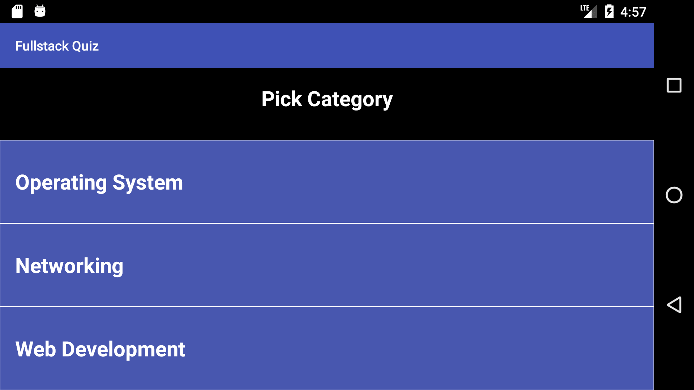
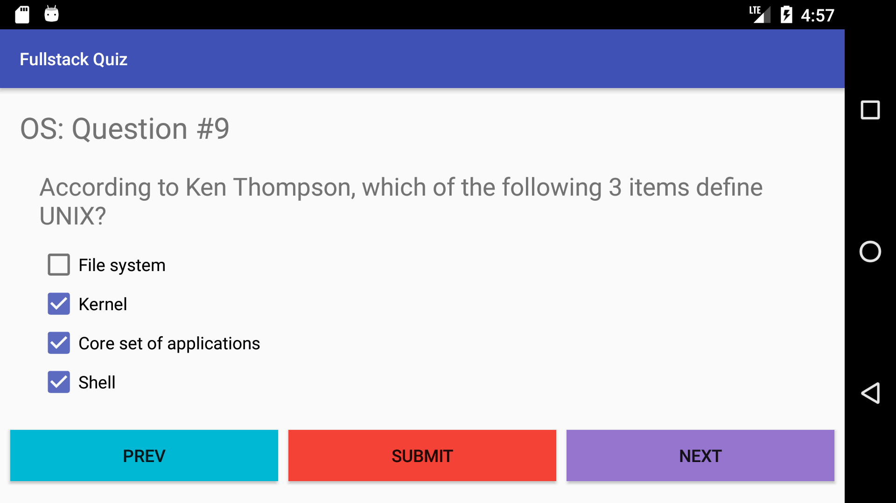
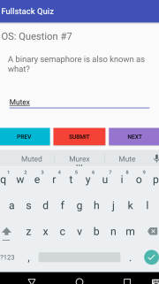
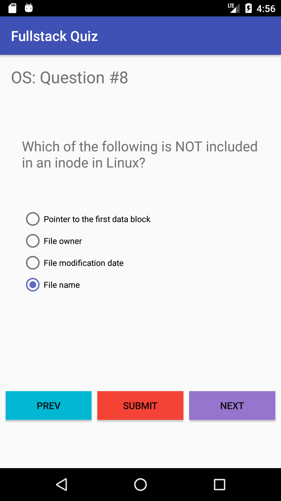

# Android Fullstack Quiz App

This is a quiz app for android that is highly extensible.

## The following are some of the features:

  - Saving and restoring states between landscapre and portrait
  - Submit button is debounced.
  - Category can be easily added using a separate xml file of questions and modifying the enums.

